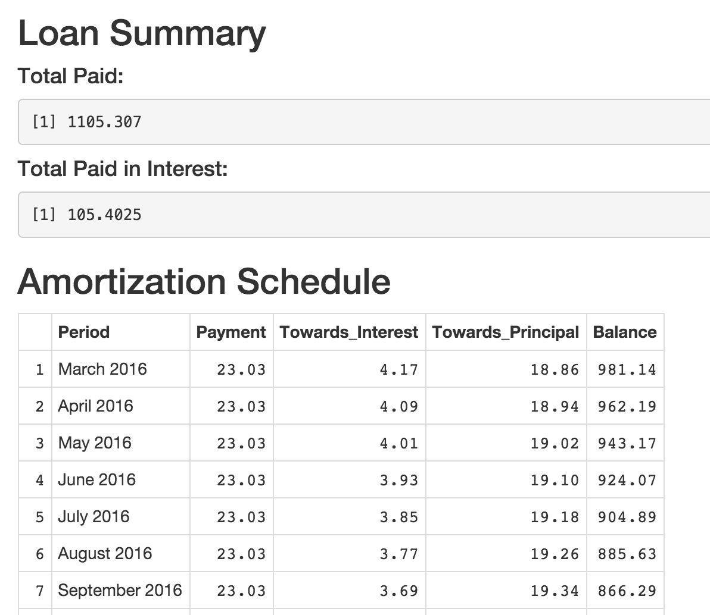

Developing Data Products Final Project
========================================================
author: Chidinma Egbukichi
date: March 6, 2015

Application: Debt_Management
========================================================

My application is a simple debt management tool to help 
the user plan out loan payments and see how long it will
take to pay back the loan

Debt_Management: Inputs
========================================================

   
The application takes four inputs:

- The amount of the loan to pay back
- The term length of the loan
- The interest rate on the loan per year as a percentage
- The loan start date

***


Debt_Management: Outputs
========================================================
1. A loan summary
  + total amount paid overall
  + total amount paid to interest
2. An amortization schedule
  + payment period
  + payment amount
  + amount paid to interest
  + amount paid to principal
  + remaining balance

***



Debt_Management: How It Works
========================================================

The application uses loan rate, length and amount to calculate monthly payment. A loan of $5,000 repaid over a 36 month period at 4.5% annual interest will have a monthly payment of:

```r
round(5000*((.045/12)/(1-(1+(.045/12))^-36)),digits=2)
```

```
[1] 148.73
```
Interest is calculated per payment based on the remaining balance. Of the first payment, this amount will go to interest:

```r
5000*.045/12
```

```
[1] 18.75
```
